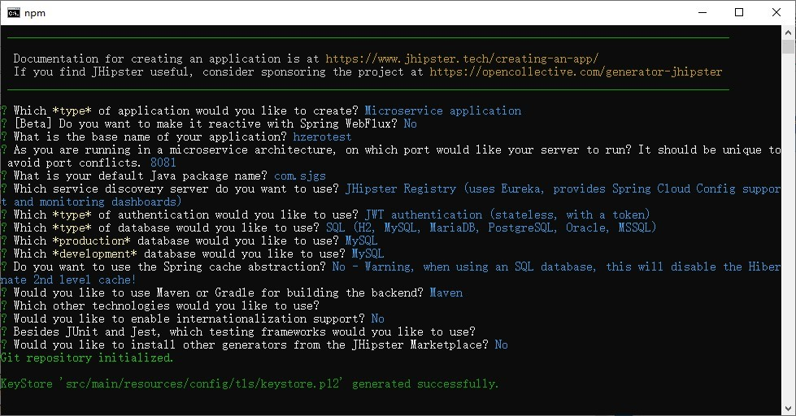
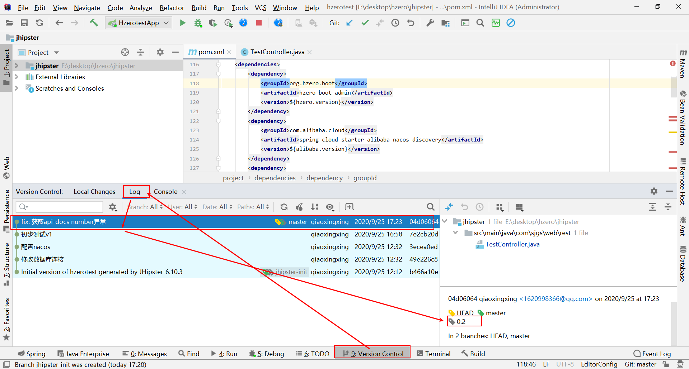
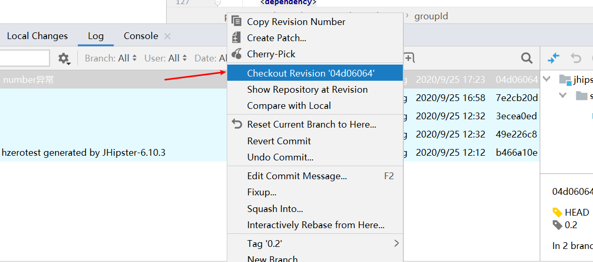
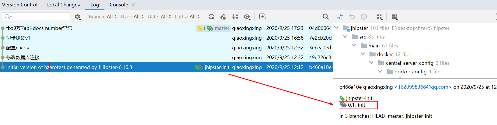
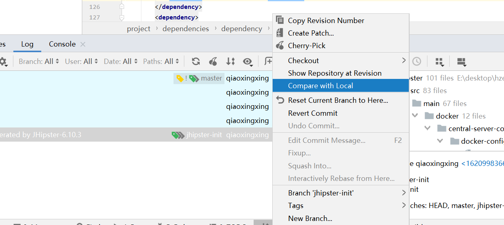
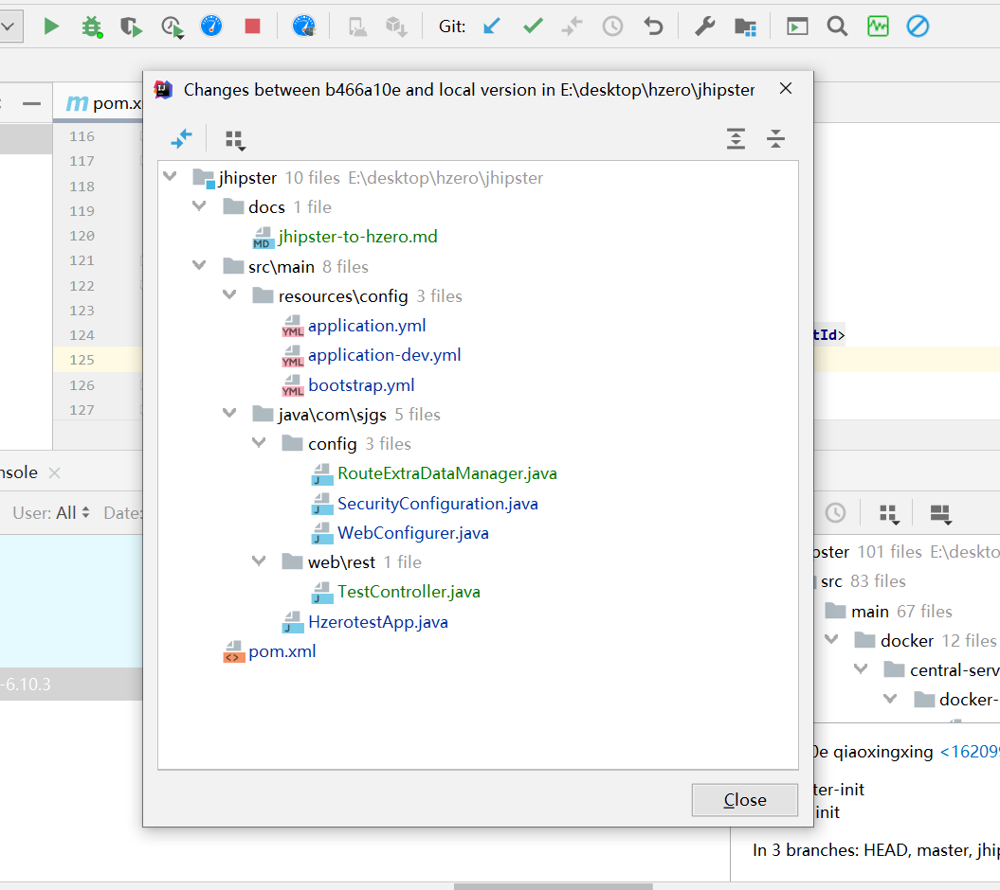
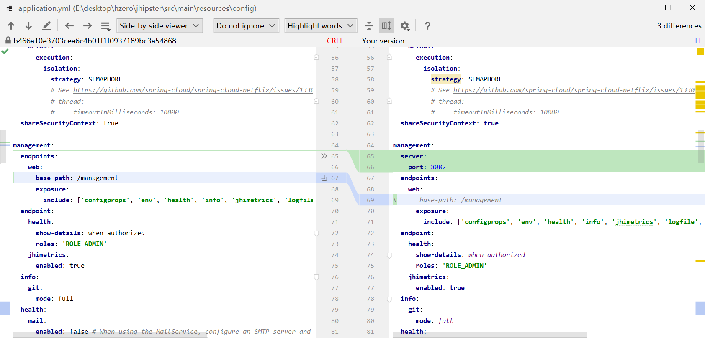

[TOC]

# 生成jhipster项目
注意: 服务类型选微服务、认证方式选择jwt;




# 迁移说明
jhipster(v6.10.3)生成的项目迁移到hzero, 需要改动的内容: 
- 注册到nacos
	- 添加依赖包
	- 修改bootstrap.yml
- 注册到hzero-admin
	- 添加`hzero-boot-admin`依赖包
	- 添加路由配置: `RouteExtraDataManager.java`
	- 禁用jhipster swagger: 修改`application.yml`等文件
	- 修改actuator配置: `application.yml`的`management`节点
- 认证
	- 添加`@EnableChoerodonResourceServer`注解
	- 注释`SecurityConfiguration.java`文件, 把它的三个注解移动到其他文件;
- 验证迁移效果的测试controller: TestController

具体的改动内容可以用git对比代码; 
git里添加的tag: 
```
0.1 jhipster初始化项目;
0.2 初步完成迁移;
```
操作步骤可以参考后面的"idea对比代码示例"

# 验证迁移是否成功
打开hzero的swagger文档: `http://<gateway>/swagger/swagger-ui.html#/`, 显示测试系统的文档且能够调用成功;


# idea对比代码示例
可以按照以下步骤对比tag 0.1和0.2的代码: 
## 1. 找到tag是0.2的commit

## 2. 切换到tag 0.2

## 3. 找到tag是0.1的commit

## 4. 对比



改动的文件列表:   



双击对比某个文件:  



